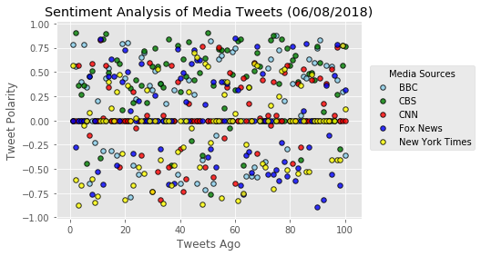

```python
# Dependencies
import tweepy
import numpy as np
import pandas as pd
from datetime import datetime
import matplotlib.pyplot as plt
from matplotlib import style
style.use('ggplot')

# Import and Initialize Sentiment Analyzer
from vaderSentiment.vaderSentiment import SentimentIntensityAnalyzer
analyzer = SentimentIntensityAnalyzer()

# Twitter API Keys
from config import (consumer_key, 
                    consumer_secret, 
                    access_token, 
                    access_token_secret)

# Setup Tweepy API Authentication
auth = tweepy.OAuthHandler(consumer_key, consumer_secret)
auth.set_access_token(access_token, access_token_secret)
api = tweepy.API(auth, parser=tweepy.parsers.JSONParser())
```


```python
# Target Account
target_users = ["@BBC", "@CBS", "@CNN", "@FoxNews", "@nytimes"]

# Variables for holding sentiments
sentiments = []

# Loop through target accounts
for target_user in target_users:
    
    # Counter
    counter = 1
    
    # Variable for max_id
    oldest_tweet = None
    
    # Loop through 5 pages of tweets (total 100 tweets)
    for x in range(5):

        # Get all tweets from home feed
        public_tweets = api.user_timeline(target_user, max_id = oldest_tweet)

        # Loop through all tweets 
        for tweet in public_tweets:

            # Run Vader Analysis on each tweet
            results = analyzer.polarity_scores(tweet["text"])
            compound = results["compound"]
            pos = results["pos"]
            neu = results["neu"]
            neg = results["neg"]
            tweets_ago = counter
        
            # Get Tweet ID, subtract 1, and assign to oldest_tweet
            oldest_tweet = tweet['id'] - 1

            # Add sentiments for each tweet into a list
            sentiments.append({"Account": target_user,
                               "Text": tweet["text"],
                               "Date": tweet["created_at"],
                               "Compound": compound,
                               "Positive": pos,
                               "Negative": neg,
                               "Neutral": neu,
                               "Tweets Ago": counter})
        
            # Add to counter 
            counter += 1
```


```python
# Convert sentiments to DataFrame
sentiments_pd = pd.DataFrame.from_dict(sentiments)
sentiments_pd.to_csv("analysis/sentiment_tweets.csv", index=False, header=True)
sentiments_pd.head()
```


<div>
<style scoped>
    .dataframe tbody tr th:only-of-type {
        vertical-align: middle;
    }

    .dataframe tbody tr th {
        vertical-align: top;
    }

    .dataframe thead th {
        text-align: right;
    }
</style>
<table border="1" class="dataframe">
  <thead>
    <tr style="text-align: right;">
      <th></th>
      <th>Account</th>
      <th>Compound</th>
      <th>Date</th>
      <th>Negative</th>
      <th>Neutral</th>
      <th>Positive</th>
      <th>Text</th>
      <th>Tweets Ago</th>
    </tr>
  </thead>
  <tbody>
    <tr>
      <th>0</th>
      <td>@BBC</td>
      <td>0.7809</td>
      <td>Fri Jun 08 18:09:05 +0000 2018</td>
      <td>0.0</td>
      <td>0.617</td>
      <td>0.383</td>
      <td>💃🕺 Why does dancing with our friends make us f...</td>
      <td>1</td>
    </tr>
    <tr>
      <th>1</th>
      <td>@BBC</td>
      <td>0.5574</td>
      <td>Fri Jun 08 17:03:04 +0000 2018</td>
      <td>0.0</td>
      <td>0.841</td>
      <td>0.159</td>
      <td>🎶🦈🚀🚗 From jazz-loving sharks to @elonmusk shoo...</td>
      <td>2</td>
    </tr>
    <tr>
      <th>2</th>
      <td>@BBC</td>
      <td>0.0000</td>
      <td>Fri Jun 08 16:02:00 +0000 2018</td>
      <td>0.0</td>
      <td>1.000</td>
      <td>0.000</td>
      <td>Leaving your responsibilities behind on a Frid...</td>
      <td>3</td>
    </tr>
    <tr>
      <th>3</th>
      <td>@BBC</td>
      <td>0.4019</td>
      <td>Fri Jun 08 13:03:05 +0000 2018</td>
      <td>0.0</td>
      <td>0.821</td>
      <td>0.179</td>
      <td>📺 From drama Succession to the return of @Pold...</td>
      <td>4</td>
    </tr>
    <tr>
      <th>4</th>
      <td>@BBC</td>
      <td>0.7840</td>
      <td>Fri Jun 08 12:28:10 +0000 2018</td>
      <td>0.0</td>
      <td>0.734</td>
      <td>0.266</td>
      <td>RT @bbcouch: We can announce today that Britai...</td>
      <td>5</td>
    </tr>
  </tbody>
</table>
</div>


```python
# Split the data by account
BBC = sentiments_pd[sentiments_pd["Account"] == "@BBC"]
CBS = sentiments_pd[sentiments_pd["Account"] == "@CBS"]
CNN = sentiments_pd[sentiments_pd["Account"] == "@CNN"]
FOX = sentiments_pd[sentiments_pd["Account"] == "@FoxNews"]
NYT = sentiments_pd[sentiments_pd["Account"] == "@nytimes"]
```


```python
# Build the scatter plots for each account
plt.scatter(BBC["Tweets Ago"], 
            BBC["Compound"], 
            s=30, c="skyblue", 
            edgecolor="black", linewidths=1, marker="o", 
            alpha=0.8, label="BBC")

plt.scatter(CBS["Tweets Ago"], 
            CBS["Compound"], 
            s=30, c="green", 
            edgecolor="black", linewidths=1, marker="o", 
            alpha=0.8, label="CBS")

plt.scatter(CNN["Tweets Ago"], 
            CNN["Compound"], 
            s=30, c="red", 
            edgecolor="black", linewidths=1, marker="o", 
            alpha=0.8, label="CNN")

plt.scatter(FOX["Tweets Ago"], 
            FOX["Compound"], 
            s=30, c="blue", 
            edgecolor="black", linewidths=1, marker="o", 
            alpha=0.8, label="Fox News")

plt.scatter(NYT["Tweets Ago"], 
            NYT["Compound"], 
            s=30, c="yellow", 
            edgecolor="black", linewidths=1, marker="o", 
            alpha=0.8, label="New York Times")

# Incorporate the other graph properties
now = datetime.now()
now = now.strftime("%m/%d/%Y")
plt.title(f"Sentiment Analysis of Media Tweets ({now})")
plt.ylabel("Tweet Polarity")
plt.xlabel("Tweets Ago")
plt.grid(True)

# Create a legend
lgnd = plt.legend(fontsize="medium", loc='upper center', bbox_to_anchor=(1.2, 0.8), title="Media Sources")

# Save Figure
plt.savefig("analysis/SentimentAnalysisScatter.png")

# Show plot
plt.show()
```





```python
# getting the overall compound score for each account
account_compound_mean = sentiments_pd.groupby(["Account"]).mean()["Compound"]
account_compound_mean
```


    Account
    @BBC        0.126592
    @CBS        0.323349
    @CNN        0.064180
    @FoxNews    0.018131
    @nytimes   -0.088194
    Name: Compound, dtype: float64


```python
# Bar chart for compound score per account
plt.bar(target_users, account_compound_mean, color=['skyblue','g','r','b','y'], alpha=1, align="center")

# Sets the y limits of the current chart
plt.ylim(min(account_compound_mean)-.05, max(account_compound_mean)+.05)

# Give our chart some labels and a tile
plt.title(f"Overall Media Sentiment based on Twitter ({now})")
plt.ylabel("Tweet Polarity")

# Save Figure
plt.savefig("analysis/SentimentAnalysisBar.png")

# Print our chart to the screen
plt.show()
```


